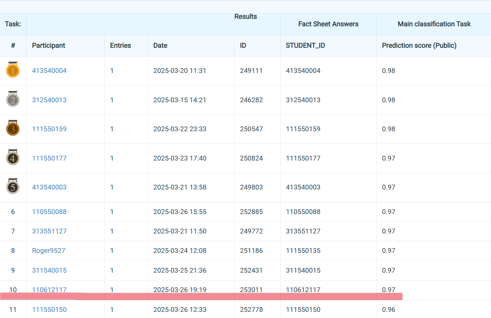

# NYCU Computer Vision (Graduate) 2025 Spring HW1
StudentID: 110612117
  
Name: Chung-Yu Chang (張仲瑜)

## Introduction:
This project implements an image classification pipeline for a 100-class classification competition.

Participants can only use ResNet-based model.

This pipeline generate a fine-tuned model achieving

Accuracy: 96.33% Validation Loss: 0.6744, Validation Accuracy: 0.8933, 

Validation Precision: 0.9155, Validation Recall: 0.8933, Validation F1: 0.8891

based on `seresnextaa101d_32x8d.sw_in12k_ft_in1k_288` from the `timm` library), and the finetune process takes 11 hours with a RTX 4060. 

## How to install
### Step 1: Clone the Repository
### Step 2: Create a new Conda environment and install the dependencies using the provided environment.yml file.
    conda env create -f environment.yml
    conda activate my_env
## Step 3: Download the dataset and unzip
https://drive.google.com/file/d/1fx4Z6xl5b6r4UFkBrn5l0oPEIagZxQ5u/view?pli=1

    -data
    -train.py
    -predict.py
    -model_pred.pth
    -model_start.pth for continue training

## To finetune certain model, run the training script:
    python train.py
## To generate predictions on the test dataset, run the prediction script:
    python predict.py

# Performance snapshot

  
