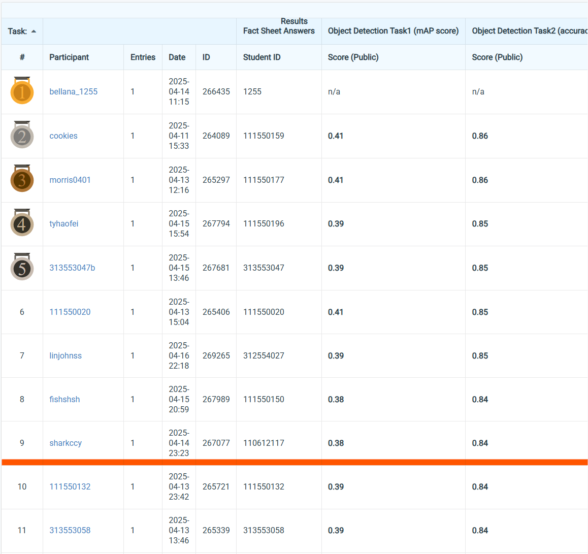
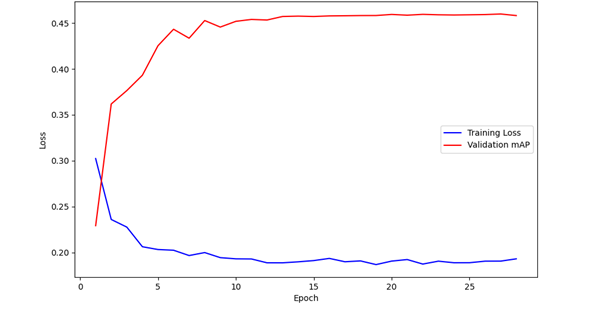
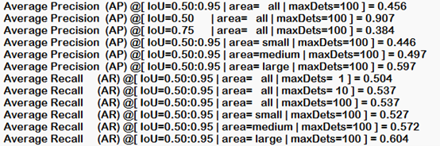

# NYCU Computer Vision (Graduate) 2025 Spring HW2
StudentID: 110612117
  
Name: Chung-Yu Chang (張仲瑜)

## Introduction:
This project implements an digit detection model for a kaggle competition.

There are two tasks in this competition: 1. Digit bounding box detection in an image 2. Digit detection in an image.

Participants can only use Faster-RCNN based model.

This pipeline generate a fine-tuned model achieving

Task 1 mAP: 0.3767, Task 2 Accuracy: 0.8477 in the competition.

With `resnetaa101d.sw_in12k_ft_in1k` from the `timm` library serving as backbone model, and a custom anchor size.

The finetune process takes 16 hours with a RTX 4060. 

## How to install
### Step 1: Clone the Repository
### Step 2: Create a new Conda environment and install the dependencies using the provided environment.yml file.
    conda env create -f environment.yml
    conda activate my_env
## Step 3: Download the dataset and unzip
https://drive.google.com/file/d/13JXJ_hIdcloC63sS-vF3wFQLsUP1sMz5/view?pli=1

    -data
    -train.py
    -predict.py
    -model_pred.pth for inference
    -model_start.pth for continue training

## To finetune certain model, run the training script:
    python train.py
## To generate predictions on the test dataset, run the prediction script:
    python predict.py

# Performance snapshot

  
