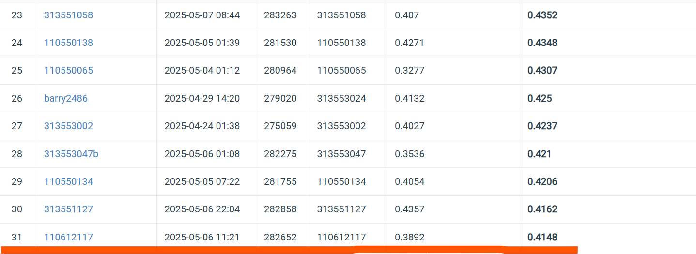

# NYCU Computer Vision (Graduate) 2025 Spring HW3
StudentID: 110612117
  
Name: Chung-Yu Chang (張仲瑜)

## Introduction:
This project implements an instance segmentation model for a kaggle competition.

There are 4 types of cells in the dataset, and the task is to classify them, and output the bounding box and mask of each cell.

Participants can only use Mask-RCNN based model.

This pipeline generate a fine-tuned model achieving

mAP: 0.4027, Task 2 Accuracy: 0.8477 in the competition.

With `seresnextaa101d_32x8d.sw_in12k_ft_in1k_288` from the `timm` library serving as backbone model, I customized a ROI head, anchor size, and the loss function including dice loss, boundary loss, focal loss, etc.

The finetune process takes 16 hours with a RTX 4060 (laptop). 

## How to install
### Step 1: Clone the Repository
### Step 2: Create a new Conda environment and install the dependencies using the provided environment.yml file.
    conda env create -f environment.yml
    conda activate my_env
## Step 3: Download the dataset and unzip
https://drive.google.com/file/d/1B0qWNzQZQmfQP7x7o4FDdgb9GvPDoFzI/view

    -data
    -train.py
    -predict.py
    -model_pred.pth for inference
    -model_start.pth for continue training

## To finetune certain model, run the training script:
    python train.py
## To generate predictions on the test dataset, run the prediction script:
    python predict.py

# Performance snapshot

  
