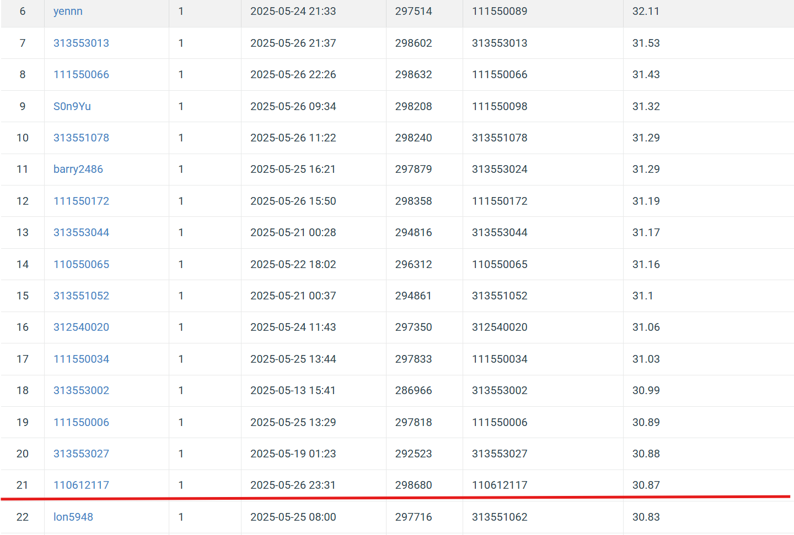
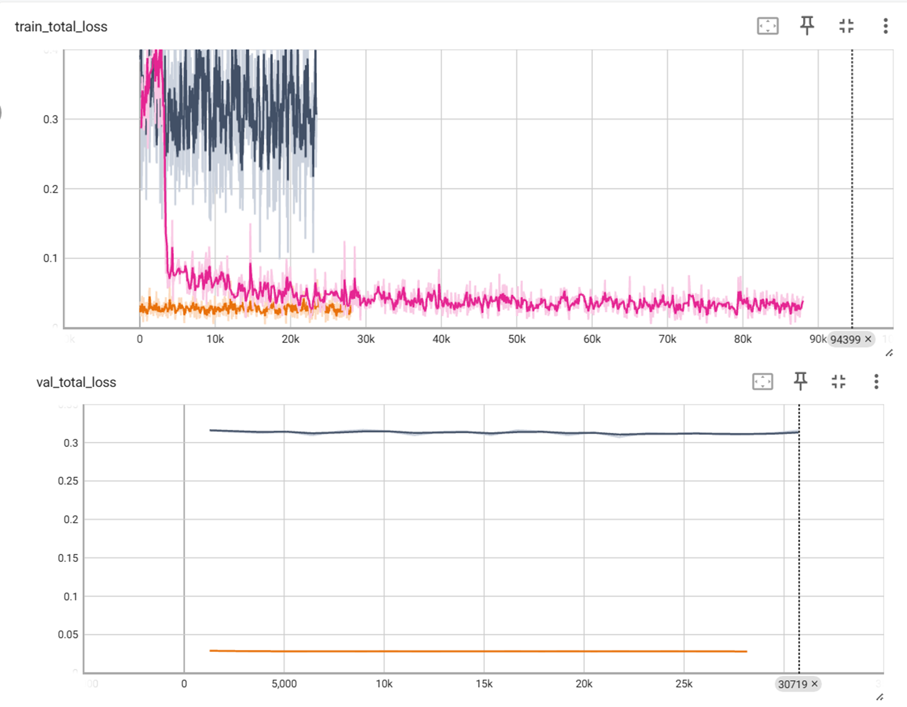

# NYCU Computer Vision (Graduate) 2025 Spring HW4
StudentID: 110612117
  
Name: Chung-Yu Chang (張仲瑜)

## Introduction:
This project modified an existing model, PromptIR for a blind-type image restoration competition.

There are 2 types of degraded images in the dataset, 1600 rainy images and 1600 snowy images.

Participants can only use PromptIR based model, and no pre-trained weights are allowed.

This pipeline generate generate a model achieving PSNR: 30.06 (dB) in the competition.

I modified the loss function including SSIM loss, Sobel Gradient loss and Fast Fourier Transform loss to improve the performance of the model.

The number of transformer blocks in each decoder is also increased to 6, 8, 8, 10 to improve the performance of the model.

The training process takes 20 hours with a RTX 4060 (laptop). 

## How to install
### Step 1: Clone the Repository
### Step 2: Create a new Conda environment and install the dependencies using the provided environment.yml file.
    conda env create -f environment.yml
    conda activate promptir
## Step 3: Download the dataset and unzip
https://drive.google.com/drive/folders/1Q4qLPMCKdjn-iGgXV_8wujDmvDpSI1ul

### Step 4: Place the dataset in the correct directory structure
    -data
    -train.py
    -test.py
    -ckpt-model.ckpt, # The inference model checkpoint
    -environment.yml

## To finetune certain model, run the training script:
    python train.py
## To generate predictions on the test dataset, run the prediction script:
    python test.py

# Performance snapshot

  
